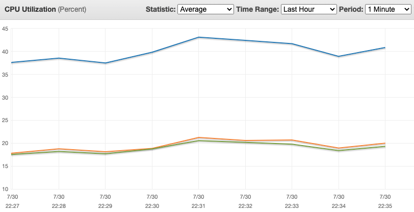

# Sorted set of byte arrays

A variant of the `sorted-set-and-hash` experiment.

Again, we have a producer updating a sorted set of items scored by timestamp. This time, however, the item ids refer to byte array values, not Redis hashes. The byte arrays are persisted to individual keys with expiration times.

A client in need of accessing the latest items will have to query the sorted set and then get the actual values by directly accessing the referred keys.

One alternative is to store in the sorted set not the ids of the items, but the item values themselves. This has the benefit of relieving the readers from having to cross-reference the ids from the sorted sets with their Redis keys - the values are now directly stored in the sorted set. This alternative method can be configured by turning the parameter `SORTED_SET_CONTAINS_ACTUAL_VALUE` in `settings.js` to `true`.

What are the CPU costs involved and how does it scale with hundreds of thousands of keys being updated simultaneously? This is what this experiment tries to measure.

## Test results

## Increasing load

Running an Elasticache Redis server with 1 cluster (1 master, 2 replicas). Each node is a `r6g.large` instance. `SORTED_SET_CONTAINS_ACTUAL_VALUE` is `false`.

Running separate 4 writer instances, each producing 10k items per second (and no read load):


```
master CPU: 11%
replicas CPU: 7.5%
```

Now still with 4 writer instances, but each one is producing 50k items, for a total of 200k items/s:


```
master CPU: 36%
replicas CPU: 24%
```

6 writer instances, each producing 50k items, for a total of 300k items/s:


```
master CPU: 50%
replicas CPU: 33%
```

Then I tried 8 writer instances, only to find out 50% CPU from the previous result is actually a bottleneck. The `r6g.large` has 2 vCPUs. Since Redis is single-threaded, we won't get past 50%.

So I tried changing the instance type. I wanted to try compute-optimized instances, but Elasticache does not provide them.

### r5 instance type

It is also a memory-optimized instance, but from a previous generation and not a Graviton machine.

Here are the results running 4 writers, each producing 10k/s:

```
master CPU: 9.5%
replicas CPU: 7%
```

A tiny bit less CPU than the `r6g.large`, but the `r5.large` is a bit more expensive (`r6g.large`: $0.1008, `r5.large`: $0.126).

Now with 4 writers, 50k items/s each one:

```
master CPU: 30%
replicas CPU: 22%
```

6 writers, 50k items/s each:

```
master CPU: 44%
replicas CPU: 31%
```

Finally, 8 writers, 50k items/s each:

```
master CPU: 53%
replicas CPU: 37%
```

And here's the bottleneck again.

My conclusion is that, although `r5.large` instances go a bit further, they quickly reach the bottleneck as well. For a load of hundreds of thousands of keys being updated simultaneously, it does not scale.

## m6g instance

TODO

## Same number of keys, more writers

If we keep the same load w.r.t. the keys updated, but divide the production in larger number of writer instances, how does it impact CPU?

```
Instance type | Writers | Items per sec each | master CPU | replica CPU
r5.large      | 6       | 50k                | 44         | 31 
r5.large      | 8       | 37.5k              | 48*        | 35 
```

Here I am using `r5.large` instances. With 8 writers, the master CPU was very unstable and, although it kept at 48% for some time, it ended up rising to a bit above 50%, so things were not exactly great. It does show that increasing the number of concurrent writers seems to affect CPU. 

Reducing the total number of keys a bit, from 300k to 240k, so we stay below the bottleneck:

```
Instance type | Writers | Items per sec each | master CPU | replica CPU
r5.large      | 5       | 48k                | 42         | 27
r5.large      | 6       | 40k                | 42         | 28
r5.large      | 8       | 30k                | 42         | 30
```


Strangely, I did not see an increase in the master CPU this time! I could not understand why was that so.

I decided to switch back to the `r6g` and test with 200k keys:

```
Instance type | Writers | Items per writer per sec | master CPU | replica CPU
r6g.large     | 4       | 50k                      | 35         | 24
r6g.large     | 8       | 25k                      | 45         | 30
```

Here we do see a significant increase when we double the number of writers. It does suggest that sharding is a must-have for larger number of writers.

Finally, a test with the `r6g.large` instance with 200k items where we can see that an increase in the number of writers is very significant:

## An additional sorted set

I decided to check what would be the CPU impact of updating an extra sorted set when sending a batch of commands. I just replicated the `zadd` command to update a second sorted set in the same batch. This is important because, as we evolve our code, we may need to add new data structures to hold new data.

This is the result:

```
Instance type | Writers | Items per writer per sec | Sorted sets | master CPU | replica CPU
r6g.large     | 8       | 25k                      | 1           | 45         | 30
r6g.large     | 8       | 25k                      | 2           | 52         | 34
```

The CPU clearly reached a bottleneck again - another indication that multi-sharding is needed. 

## Batch periodicity

If we space batches in time (thus effectively lowering the send rate), how is the average CPU time affected?

```
Instance type | Writers | Items per writer per sec | Interval ms | master CPU | replica CPU
r6g.large     | 4       | 50k                      | 1000        | 35         | 24
r6g.large     | 4       | 50k                      | 1500        | 28.5       | 19
r6g.large     | 4       | 50k                      | 2000        | 22.5       | 15.5
```

Halving the send rate does not halve the CPU usage, but it's clearly a way to go if you need to scale (if you have the option of reducing the rate, of course).

## Breaking batches in time

What if the writer divides batches in chunks and sends them individually? Is it better to send 100 items in a single batch or 50 items twice as frequently?

```
Instance type | Writers | Items per writer per sec | Chunks | Interval ms | master CPU | replica CPU
r6g.large     | 4       | 50k                      | 1      | 1000        | 35         | 24
r6g.large     | 4       | 50k                      | 2      | 1000        | 36         | 24
r6g.large     | 4       | 50k                      | 4      | 1000        | 36         | 24
```

It seems that dividing in chunks in time does not have any effect.

## Sorted set containing reference vs actual value

By default, the producer writes both the item keys and updates the sorted set with the ids of those items. If instead we write the actual item to the sorted set and avoid writing individual keys, what is the CPU gain?

```
Instance type | Actual value? | Writers | Items per sec each | master CPU | replica CPU
r6g.large     | Yes           | 6       | 50k                | 33         | 20
r5.large      | Yes           | 6       | 50k                | 26         | 20
r5.large      | No            | 6       | 50k                | 43         | 31 
```

## Sending keys only once, but running them through a Lua script

The idea here is a variation in the test above (references vs actual values). Instead of just having the sorted set with the actual values, we have a Lua script that receives the values and then populates the sorted set AND creates the individual keys. This test answers the following question: what increases the cost when having a sorted set + individual keys? Is it the multiple Redis commands or is it the increased network traffic?

The tests here were run with the `--ws` flag to enable the Lua script for the writer.

The first results:

```
Instance type | Writers | Chunks | Items per sec each | master CPU | replica CPU
r6g.large     | 4       | 1      | 2.5k               | 19         | 3.5
r6g.large     | 4       | 1      | 5k                 | 48         | 4
```

These first tests showed that running the Lua script is a very heavy operation. I tried the first test with each instance writing 50k, but the Elasticache Redis simply stopped responding for a couple of minutes! Not even `redis-cli --stat` clients were getting a response.

Trying 5k items per instance got me close to the bottleneck already. Then I tried splitting the load into two separate transmissions in the same 1-second window and there was an improvement:

```
Instance type | Writers | Chunks | Items per sec each | master CPU | replica CPU
r6g.large     | 4       | 1      | 5k                 | 48         | 4
r6g.large     | 4       | 2      | 5k                 | 34.5       | 6
r6g.large     | 8       | 1      | 10k                | 51         | 10
r6g.large     | 8       | 2      | 10k                | 51         | 10
```

Differently than the test where we split the batch (the regular one not using a Lua script a few sections above) where we didn't see any change, this current test is showing that the batch size does cause problems in the Lua script execution.

To understand what exactly may be causing this, I edited the Lua script to basically do nothing. The Redis calls were commented out to rule out the possibility of the actual Redis calls being the culprits. Running the tests again, the slowness was still seen. As a matter of fact, commenting out the whole Lua script (making it just `return 0`) still runs very slowly and the CPU hits the bottleneck just the same when the 8-writer, 10k-each test above is run.

The next interesting thing done was to run a new Lua script that, instead of receiving all keys and values, would receive a single key-value pair to process. The previous script is called `store-items.lua` and the new one is called `store-item.lua` (singular). The results were surprisingly better than the all-keys script, although still not good:



Although below the bottleneck, the CPU was varying a lot, with the master node ranging from 38 up to 43%.

Using Lua scripts here is definitely not the way to go.

## Lua script vs manually running commands

TODO

On the reader side, is the Lua script more efficient for not requiring multiple network roundtrips?

## How consumers affect CPU

How does adding consumers affect CPU? If they are reading from replicas, it shouldn't matter at all.

TODO

## Multiple shards

Here I want to test how ioredis deals with multiple shards and if it's able to find where keys are by its own.

## Sorted set vs lists

TODO

This is probably a separate experiment, but the question is: is using a list to get the latest K items faster than using a sorted set?

These data structures are not directly interchangeable, but they can replace one another in certain situations. For instance, if you need the K latest items, you are good. If you also need to count the latest unique items still valid, you won't be able to count them with a list. You will probably need an auxiliary HyperLogLog structure for that.
