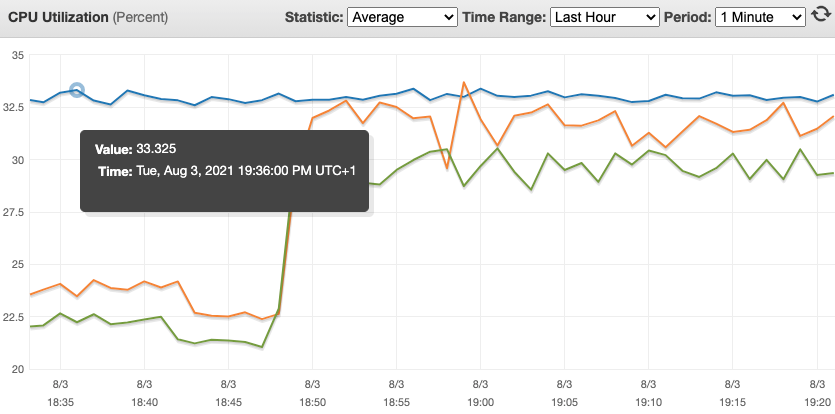
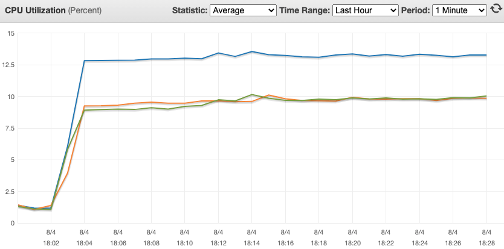

# Sorted set of byte arrays

A variant of the `sorted-set-and-hash` experiment.

Again, we have a producer updating a sorted set of items scored by timestamp. This time, however, the item ids refer to byte array values, not Redis hashes. The byte arrays are persisted to individual keys with expiration times.

A client in need of accessing the latest items will have to query the sorted set and then get the actual values by directly accessing the referred keys.

One alternative is to store in the sorted set not the ids of the items, but the item values themselves. This has the benefit of relieving the readers from having to cross-reference the ids from the sorted sets with their Redis keys - the values are now directly stored in the sorted set. This alternative method can be configured by turning the parameter `SORTED_SET_CONTAINS_ACTUAL_VALUE` in `settings.js` to `true`.

What are the CPU costs involved and how does it scale with hundreds of thousands of keys being updated simultaneously? This is what this experiment tries to measure.

## Test results

## Increasing load

Here we are running an Elasticache Redis server with 1 cluster (1 master, 2 replicas). Each node is a `r6g.large` instance. `SORTED_SET_CONTAINS_ACTUAL_VALUE` is `false`, so we are keeping a sorted set of item ids and the items themselves are in their own separate keys.

Running 4 writer instances, each producing 10k items per second (and no read load):


Averages:

```
master CPU: 11%
replicas CPU: 7.5%
```

Now still with 4 writer instances, but each one is producing 50k items, for a total of 200k items/s:


```
master CPU: 36%
replicas CPU: 24%
```

6 writer instances, each producing 50k items, for a total of 300k items/s:


```
master CPU: 50%
replicas CPU: 33%
```

Then I tried 8 writer instances, only to find out 50% CPU from the previous result is actually a bottleneck. The `r6g.large` has 2 vCPUs. Since Redis is single-threaded, we won't get past 50%.

So I tried changing the instance type. I wanted to try compute-optimized instances, but Elasticache does not provide them.

### r5 instance type

It is also a memory-optimized instance, but from a previous generation and not a Graviton machine.

Here are the results running 4 writers, each producing 10k/s:

```
master CPU: 9.5%
replicas CPU: 7%
```

A tiny bit less CPU than the `r6g.large`, but the `r5.large` is a bit more expensive (`r6g.large`: $0.1008, `r5.large`: $0.126).

Now with 4 writers, 50k items/s each one:

```
master CPU: 30%
replicas CPU: 22%
```

6 writers, 50k items/s each:

```
master CPU: 44%
replicas CPU: 31%
```

Finally, 8 writers, 50k items/s each:

```
master CPU: 53%
replicas CPU: 37%
```

And here's the bottleneck again.

My conclusion is that, although `r5.large` instances go a bit further, they quickly reach the bottleneck as well. For a load of hundreds of thousands of keys being updated simultaneously, it won't scale the same.

## m6g instance and side-by-side comparison of all 3 types

Adding the `m6g.large` instance type, the test now involves a single shard, 8 writers producing a total of 200k items per second and no readers. The results:

```
EC2 type  | master CPU | replica CPU | vCPU | GB | Hourly rate | Monhtly rate
r6g.large | 40         | 27          | 2    | 16 | $0.1008     | $72.58
m6g.large | 40         | 26.5        | 2    | 8  | $0.0770     | $55.44
r5.large  | 37         | 25          | 2    | 16 | $0.1260     | $90.72
```

Considering 8 GB is good enough, `m6g` types are a better option than `r6g` ones since they are considerably cheaper. 

In the tests that follow, we will focus on comparing different Redis functionalities and not EC2 instances per se. Each test may use different instance types, but that is not a big deal since the tests are simply meant to compare features turned on/off and not how instances compare to each other.

## Same number of keys, more writers

If we keep the same load w.r.t. the keys updated, but divide the production by a larger number of writer instances, how does it impact CPU?

```
Instance type | Writers | Items per sec each | master CPU | replica CPU
r5.large      | 6       | 50k                | 44         | 31 
r5.large      | 8       | 37.5k              | 48*        | 35 
```

Here I am using `r5.large` instances. With 8 writers, the master CPU was very unstable and, although it kept at 48% for some time, it ended up rising to a bit above 50%, so things were not exactly great. It does show that increasing the number of concurrent writers seems to affect CPU. 

Now reducing the total number of keys a bit, from 300k to 240k, so we stay below the bottleneck and have more reliable results:

```
Instance type | Writers | Items per sec each | master CPU | replica CPU
r5.large      | 5       | 48k                | 42         | 27
r5.large      | 6       | 40k                | 42         | 28
r5.large      | 8       | 30k                | 42         | 30
```


Strangely, I did not see an increase in the master CPU this time! I could not understand why was that so and I suspect 42% was somehow at capacity already. I'd need to repeat these tests to understand better.

Here I decided to switch back to the `r6g` and test with 200k keys:

```
Instance type | Writers | Items per writer per sec | master CPU | replica CPU
r6g.large     | 4       | 50k                      | 35         | 24
r6g.large     | 8       | 25k                      | 45         | 30
```

Now we do see a significant increase when we double the number of writers. It does suggest that sharding is a must-have for a larger number of writers.

## An additional sorted set

I decided to check what would be the CPU impact of updating an extra sorted set when sending a batch of commands. I just replicated the `zadd` command to update a second sorted set in the same batch. This is important because, as we evolve our code, we may need to add new data structures to hold new data.

This is the result:

```
Instance type | Writers | Items per writer per sec | Sorted sets | master CPU | replica CPU
r6g.large     | 8       | 25k                      | 1           | 45         | 30
r6g.large     | 8       | 25k                      | 2           | 52         | 34
```

The CPU clearly reached a bottleneck again - another indication that multi-sharding is needed as the application evolves and needs more structures. 

## Batch periodicity

If we space batches in time (thus effectively lowering the send rate), how is the average CPU time affected?

```
Instance type | Writers | Items per writer per sec | Interval ms | master CPU | replica CPU
r6g.large     | 4       | 50k                      | 1000        | 35         | 24
r6g.large     | 4       | 50k                      | 1500        | 28.5       | 19
r6g.large     | 4       | 50k                      | 2000        | 22.5       | 15.5
```

Halving the send rate does not halve the CPU usage, but it's clearly a way to go if you need to scale (if you have the option of reducing the rate, of course).

## Breaking batches in time

What if, instead of sending a big batch from time to time, the sender sends smaller chunks but more frequently, such that the effective rate does not change? For example, is it better to send 100 items every 1000ms or 50 items every 500ms?

The results:

```
Instance type | Writers | Items per writer per sec | Chunks | Interval ms | master CPU | replica CPU
r6g.large     | 4       | 50k                      | 1      | 1000        | 35         | 24
r6g.large     | 4       | 50k                      | 2      | 500         | 36         | 24
r6g.large     | 4       | 50k                      | 4      | 250         | 36         | 24
```

It seems that dividing in chunks in time does not have any effect on CPU (averaged every minute by CloudWatch), at least for 200k items/sec. Probably the instantaneous CPU is affected, but CloudWatch does not show averages smaller than 1 minute, so there's no easy way to tell.

## Sorted set containing reference vs actual value

By default, the producer writes both the item keys and updates the sorted set with the ids of those items. If instead we write the actual item to the sorted set and avoid writing individual keys, what is the CPU gain?

```
Instance type | Actual value? | Writers | Items per sec each | master CPU | replica CPU
r5.large      | Yes           | 6       | 50k                | 26         | 20
r5.large      | No            | 6       | 50k                | 43         | 31 
```

This test is a bit dumb, because of course CPU usage will drop as you no longer need to update several keys but only one. This is just basically showing the cost of running 200k `setex` per second. I'm going to keep it here just because it brings some extra info that could be useful for someone. The next test will add more useful information.

## Sending keys only once, but running them through a Lua script

The idea here is a variation in the test above (references vs actual values). Instead of just having the sorted set with the actual values, we have a Lua script that receives the values and then populates the sorted set AND creates the individual keys. This test answers the following question: what increases the cost when having a sorted set + individual keys? Is it the multiple Redis commands or is it the increased network traffic? Spoiler alert: none of them.

The tests here were run with the `--ws` flag to enable the Lua script for the writer.

The first results, both with the flag enabled:

```
Instance type | Writers | Chunks | Items per sec each | master CPU | replica CPU
r6g.large     | 4       | 1      | 2.5k               | 19         | 3.5
r6g.large     | 4       | 1      | 5k                 | 48         | 4
```

These first tests showed that running the Lua script is a very heavy operation. I innocently tried running each instance writing 50k, but the Elasticache Redis simply stopped responding for a couple of minutes! Not even `redis-cli --stat` clients were getting a response.

Trying 5k items per instance got me close to the bottleneck already. Then I tried splitting the load into two separate transmissions in the same 1-second window and there was an improvement:

```
Instance type | Writers | Chunks | Items per sec each | master CPU | replica CPU
r6g.large     | 4       | 1      | 5k                 | 48         | 4
r6g.large     | 4       | 2      | 5k                 | 34.5       | 6
r6g.large     | 8       | 1      | 10k                | 51         | 10
r6g.large     | 8       | 2      | 10k                | 51         | 10
```

Differently than the test where we split the batch (the regular one not using a Lua script a few sections above) where we didn't see any change, this current test is showing that the batch size does cause problems in the Lua script execution.

To understand what exactly may be causing this, I edited the Lua script to basically do nothing. The Redis calls were commented out to rule out the possibility of the actual Redis calls being the culprits. Running the tests again, the slowness was still seen. As a matter of fact, commenting out the whole Lua script (making it just `return 0`) still runs very slowly and the CPU hits the bottleneck just the same when the 8-writer, 10k-each test above is run.

The next interesting thing done was to run a new Lua script that, instead of receiving all keys and values, would receive a single key-value pair to process. The previous script is called `store-items.lua` and the new one is called `store-item.lua` (singular). The results were surprisingly better than the all-keys script, although still not good:


Although below the bottleneck, the CPU was varying a lot, with the master node ranging from 38 up to 43%. Compare it with the regular test where no Lua script is used, the individual keys hold their values and the sorted set has a reference to each key:

```
Instance type | Writers | Items per sec each | master CPU | replica CPU
r6g.large     | 8       | 10k                | 21.5       | 14
```

Using Lua scripts here is definitely not the way to go.

## Sorted set vs lists

Is using a list to get the latest K items significantly faster than using a sorted set?

These data structures are not directly interchangeable, but they can replace one another under certain situations. For instance, say you are currently using a sorted set to be able to fetch the latest items from the last X seconds. You could in principle replace it with a list if your requirement "from the last X seconds" could be relaxed to "the last K items".

Let's compare the baseline test (saving to individual keys + sorted set) to the list one (individual keys + list) by toggling on the `--sl` flag:

```
Test       | Instance type | Writers | Items per sec each | master CPU | replica CPU
Sorted set | r6g.large     | 8       | 25k                | 44.5       | 29
List       | r6g.large     | 8       | 25k                | 36         | 24
```

We can reduce the CPU to 80% of the sorted set test if we use a list instead.

Now say that we also use the sorted set to count active elements. For instance, the unique items that were posted in the last X seconds. The list doesn't provide an easy way to count the unique items. `LLEN` will not give you the count you want if your items are regularly updated and added to the list. With a sorted set, counting uniques would be easy, but with a list we need something else.

One idea is to use a HyperLogLog structure for that. Creating a new HLL every minute, we can use the one from the previous minute to have an estimate on the count. It won't be an exact count because 1) HLLs provide only an approximation and 2) the count is delayed a whole minute since we need to accumulate the data before using it.

Here's the result of turning HLL on:


```
Instance type | Writers | Items per sec each | master CPU | replica CPU
r6g.large     | 8       | 25k                | 30.5       | 18.5
```

In the chart above, the HLL is turned (`--sl --slh`) on at 14:36 and off at 14:49. The periods before and after that in the chart show a test running with only `--slh`. Strangely, turning on the HLL count brought the CPU usage *down* - although more work is being performed! Also strange, CPU usage is not constant for some reason (differently from all other tests seen so far). I'd have to repeat this test to investigate more, but the main thing learned here is that sorted sets are a bit more expensive and you may need to reconsider using them when having many entries - and lists may be a viable alternative.

## Sorted sets vs sets

We could also replace the sorted set with a set, similarly to the list idea above - one set being created every minute to hold the latest items. It would both give the latest items and the count of uniques.

The test results are very similar to the ones with the HLL above, including the inconstant CPU usage:

```
Instance type | Writers | Items per sec each | master CPU | replica CPU
r6g.large     | 8       | 25k                | 31.5       | 18.5
```


To the left of the red bar, the list+HLL test; to the right, the set test.

It seems that sets would be easier to use, since an extra structure (the HLL) is not needed to count uniques.

The drawback of both the list and the set approach is that counting uniques imposes a delay until you accumulate the data. At 10:01:59, your latest unique count will be the one that was counted between 10:00:00 and 10:00:59 - i.e., your count may be 1 minute late if you keep 1-minute lists/sets. With the sorted set, however, you can always respond with a fresh count.

## Multiple shards

In this test we add multiple shards to see how the writer load scales. Changing the producer code to deal with multiple shards was relatively simple (basically just a matter of replacing `new Redis()` with `new Redis.Cluster()`), but I was manually pipelining commands using `client.pipeline()` and this doesn't work with multiple shards since each node must have its own pipeline. `ioredis` could internally split commands into separate pipelines, but it doesn't do it for the `pipeline()` method. Thankfully, it does create individual pipelines if you toggle on the option `enableAutoPipelining`, so I changed the code to use it. Auto-pipelining groups commands on every Node.js event loop tick, which is a clever mechanism and perfectly fine for my pipeline requirements.

Now for the results. My test cluster had 3 shards, each with 1 master and 2 replicas each. This is the baseline result for the single-shard test with 8 writers, 25k items/s each:

```
Instance type | Writers | Items per writer per sec | master CPU | replica CPU
r6g.large     | 8       | 25k                      | 45         | 30
```

Now the multi-shard results (same 8 writers with 25k items/s each):

```
Node      | CPU
master  1 | 11
master  2 | 25
master  3 | 11
replica 1 | 8
replica 2 | 16
replica 3 | 8
```

CPUs are considerably lower since the load was spread across the shards - definitely scaled well. Shard #2 had higher CPU usage due to the fact that it stored the sorted set slot and, as we've seen in other tests, sorted sets use a lot of CPU.

Now we are finally able to scale to 300k items per second, number we couldn't achieve in single-shard mode. To run 37.5k items/sec per writer, I had to increase Node.js' stack size. That's how I ran it:

    node --stack-size=2000 producer.js --cluster -q 300000 -t 8 -a 1

And here are the results:

```
Node      | CPU
master  1 | 13.5
master  2 | 32
master  3 | 13.5
replica 1 | 9.5
replica 2 | 21
replica 3 | 9.5
```

And why not 400k items/sec?

```
Node      | CPU
master  1 | 15
master  2 | 37.5
master  3 | 15
replica 1 | 10
replica 2 | 24
replica 3 | 11
```

I tried 500k, but the maximum limit each writer could handle was ~52k (the writer must be able to send all commands within a 1-second time frame to be able to keep the intended rate - but the ioredis client could not keep up with it), so I'd have to increase the number of writers to be able to go higher.

## Consumers

Here we add consumers to the 3-shard test. On the producer side we have 8 instances producing a total of 300k items/sec. Consumers (a total of 8 as well), on the other side, ask basically for 3 things (and do it exclusively on replicas):

- `zcard` on `latest-ids`
- `zrangebyscore` on `latest-ids` fetching all still-valid keys (which sums up to 300k)
- a pipelined series of `get` commands for each one of the keys returned by the `zrangebyscore`

Each consumer requests that data once every second.

Let's see the results, starting with shard number 2, where the sorted set lives. At around 18h47, where the consumers are turned on, we can see a significant increase in the replicas CPU, where the reads are happening:



Worth noting that master CPU does not change, confirming that consumers are reading exclusively from replicas.

This is shard number 1:


And finally shard number 3:


On the consumer side, each batch was taking about 4.5 seconds to finish:

```
Cardinality: 300000
Responses received: 300000
Batch processed (took 4690 ms)
```

By disabling the `get` commands, we can verify that `zcard` + `zrangebyscore` correspond to less than 10% of that time:

```
Batch processed (took 317 ms)
```

Important to mention that this is possibly not a Redis bottleneck, but the Node.js package ioredis that is not doing a good job of deserializing what arrived from the network. Hard to tell without doing deeper tests.

Fetching the whole live collection of 300k items all the time may not be wanted or realistic, so here I decided to test an application where we are interested only in the most recent 1000 items of the 300k. Instead of doing `zrangebyscore latest-ids cutOffTime +inf`, we are now doing `zrevrangebyscore latest-ids +inf cutOffTime limit 0 1000` to fetch at most 1k items, and those will always be the latest ones by score due to the `rev` in `zrevrangebyscore`.

Here's how the consumer is called:

    node consumer.js --cluster --limit 1000

Again, there are 8 producers and 8 consumers. And here are the results of shards 1, 2 and 3 respectively:




The writers start at around 18:03 and the readers at 18:12. As we can see, the replicas (shown by orange and green lines) are not visibly affected by the readers since the requested data is significantly smaller.

Since the load was small, I decided to try more frequent fetches to simulate a higher number of consumers. First fetching once every 500ms (equivalent to 16 readers per sec), than once every 250ms (32 readers per sec). Still no visible changes if compared with having no readers.

## 10 sorted sets of 30k items each

What role does the size fo the sorted set plays in the time it takes for producers to add items to it? What happens if we still send 300k items/sec, but items are now evenly split among 10 different sorted sets?

Here are the results of 8 writers producing 300k items/sec with no readers. Before 20:25 we have the baseline code, saving all 300k to a single sorted set, and after that we have 10 sorted sets dividing that same load:

```
node --stack-size=2000 producer.js --cluster -q 300000 -t 8 -a 1 --ns 10 
```


If we take the average of master CPU usage across shards, before and after 20:25:

```
shard | CPU before | CPU after
1     | 14         | 23
2     | 33         | 22.5
3     | 13.5       | 13.5
```

If we simply sum CPU usage before and after 20:25, we'll see that the sum stays practically the same (60.5% vs 59%). The good thing is that having more sorted sets helps to balance the load, since they will be fatally be hashed into different shards.

Note: the third shard did not see a change in CPU usage because no sorted set was hashed into it.

### Sharding all sets into the same slot

Just to see what happens with the CPU when all sorted sets are hashed into the same shard, I added the `--same-slot` option:

```
node --stack-size=2000 producer.js --cluster -q 300000 -t 8 -a 1 --ns 10 --same-slot
```

This makes all sorted sets be named like `latest-ids:<number>{forced-slot}`, where the `{*}` suffix will make all of them fall into the same slot. With 3 shards, they are slotted into shard 1. The results are:

```
shard | master CPU | replica CPU
1     | 32         | 20.5
2     | 14         | 9.5
3     | 13         | 9.5
```

And 32% is exactly what we have with a single sorted set, meaning it doesn't make much difference how many sets are you updating, but only the number of items involved (of course, keeping in mind that having multiple sets will help to balance the load when they are not forced into the same slot).

## Online scaling of shards

In this test we see what happens when we change the number of shards while writers and readers are operating.

My first test was to kill shard number 3. ioredis did not do very well and was stopping due to ReplyError exceptions with the `MOVED` message. I don't know why, but ioredis was not following the redirection and just throwing.

Anyway, these are the results running 2 shards with 300k items/sec being written by 8 producers, no readers:

```
shard | master CPU | replica CPU
1     | 19         | 13
2     | 37         | 24.5
```

Pretty comfortable with 300k items.

Now back to the ioredis problem:

```
/home/lucio/redis-nodejs-test/node_modules/redis-parser/lib/parser.js:179
    return new ReplyError(string)
           ^

ReplyError: MOVED 13664 10.91.16.155:6379
    at parseError (/home/lucio/redis-nodejs-test/node_modules/redis-parser/lib/parser.js:179:12)
    at parseType (/home/lucio/redis-nodejs-test/node_modules/redis-parser/lib/parser.js:302:14) {
  command: {
    name: 'setex',
    args: [
      'item:35',
      ...
```

TODO
